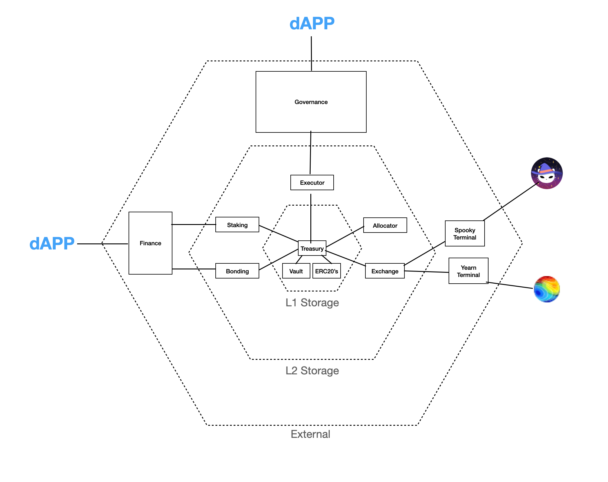

# The Phantom Dao Network

## Getting Started
We use the Brownie deployment system for Solidity/Ethereum: [View Docs](https://eth-brownie.readthedocs.io/en/stable/)

1. Install dependencies
```bash
pip3 install -r requirements.txt
npm install --save-dev ganache-cli
npm install --save-dev prettier prettier-plugin-solidity
```

2. Test Compiling contract(s) 
```
brownie compile
```

## Before Commiting Code / Opening a Pull Request

We use the Brownie deployment system for Solidity/Ethereum: [View Docs](https://eth-brownie.readthedocs.io/en/stable/)


1. Make your Solidity Pretty
```
npx prettier --write 'contracts/**/*.sol'
```

2. Make your Python Pretty
```
flake8 .
```

3. Run your tests
```
brownie test -v --gas
```

## High Level Network Architecture

